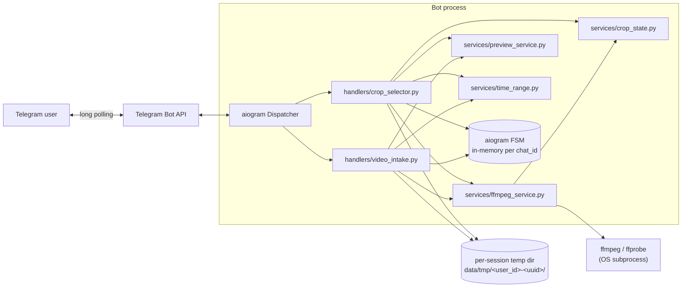
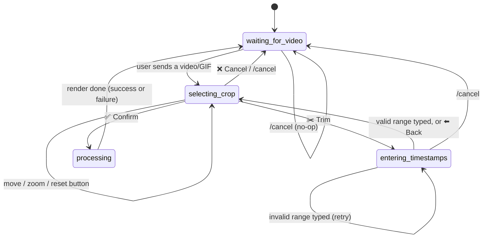
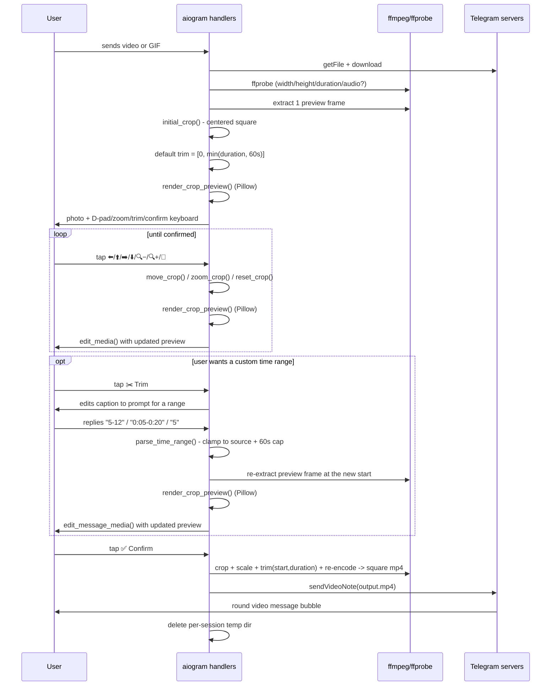

# Architecture & Implementation Notes

This document explains **why** the bot is built the way it is, not just
what the code does. Read this before modifying `bot/services/` — most of
the non-obvious decisions live there.

## Table of contents

1. [The key insight: Telegram does the rounding for you](#1-the-key-insight-telegram-does-the-rounding-for-you)
2. [High-level architecture](#2-high-level-architecture)
3. [Conversation flow / FSM](#3-conversation-flow--fsm)
4. [Component reference](#4-component-reference)
5. [Crop-box math](#5-crop-box-math)
6. [Trim / timestamp selection](#6-trim--timestamp-selection)
7. [The ffmpeg pipeline](#7-the-ffmpeg-pipeline)
8. [Preview rendering](#8-preview-rendering)
9. [GIF support](#9-gif-support)
10. [Telegram platform constraints](#10-telegram-platform-constraints)
11. [Error handling & edge cases](#11-error-handling--edge-cases)
12. [Security & privacy](#12-security--privacy)
13. [Testing strategy](#13-testing-strategy)
14. [Deployment](#14-deployment)
15. [Known limitations & future enhancements](#15-known-limitations--future-enhancements)

---

## 1. The key insight: Telegram does the rounding for you

The reference screenshot (a round bubble with a play button and duration)
is Telegram's native **video message** UI element. It's sent via a single
Bot API method, [`sendVideoNote`](https://core.telegram.org/bots/api#sendvideonote):

> As of v.4.0, Telegram clients support rounded square MP4 videos of up to
> one minute long. Use this method to send video messages.

The important word is **square**. The Bot API's own parameter for it is
literally called `length` — "video width and height, i.e. diameter of the
video message, in pixels." Telegram's clients (mobile, desktop, web) take
that square video and clip it to a circle **at render time**, on every
device that displays it. The bot never uploads a circle — it uploads a
square, and every Telegram client agrees to draw only the circle inscribed
in that square, with rounded-corner chrome (the play icon, timestamp,
read-receipt ticks) drawn on top by the client itself.

This matters a lot for how the bot is implemented:

- **We never need an alpha channel.** No transparent PNG frames, no VP9
  `yuva420p` tricks, no `.webm` with alpha — the file we send is a boring
  H.264/AAC `.mp4`, identical in format to what a phone's Telegram app
  records. Baking in real per-pixel transparency would be strictly more
  work for a *worse* result: Telegram would still re-clip it to a circle
  on top of our own (possibly slightly misaligned) transparency, and an
  alpha-carrying video is far more likely to hit a codec Telegram's
  encoder pipeline chokes on.
- **The *corners* of our square crop don't matter.** Whatever ends up in
  the corners is invisible in every Telegram client, forever. This is why
  the crop-selection UI is built around a *circle* overlaid on the
  preview even though the actual `ffmpeg` operation underneath is a plain
  rectangular `crop` filter — the square's corners are a don't-care.
- **"Selecting where the circle goes" is really "selecting a square crop
  region."** The user-facing metaphor (drag a circle around) and the
  underlying operation (crop a square, let Telegram do the rest) are
  different, and that gap is exactly what `bot/services/crop_state.py` +
  `bot/services/preview_service.py` bridge: the math and the ffmpeg
  filter only ever deal with squares; the *preview image* is what
  translates that into "here's the circle you'll actually see."

If you ever find yourself wanting to add real circular masking/alpha to
this codebase, stop and ask why — it's very likely solving a problem
Telegram already solves for you, at the cost of a much heavier and more
fragile pipeline. (See [§15](#15-known-limitations--future-enhancements)
for the one legitimate reason you might still want it.)

## 2. High-level architecture

Single-process Python bot, long-polling the Bot API (no inbound webhook,
so no public HTTPS endpoint is required to run it). All heavy lifting
(decoding, cropping, scaling, re-encoding) is delegated to the `ffmpeg`
binary via subprocesses; Python only orchestrates.



**No database.** Conversation state lives in aiogram's in-memory FSM
storage (`MemoryStorage`), keyed by `(chat_id, user_id)`; media lives on
local disk in a per-session directory. This is a deliberate scope
decision for a single-instance bot — see
[§15](#15-known-limitations--future-enhancements) for what changes if you
need to run more than one worker process.

## 3. Conversation flow / FSM

Four states, defined in `bot/states.py`:



Sequence for one full round-trip (trim step is optional):



## 4. Component reference

| File | Responsibility |
|---|---|
| `bot/main.py` | Builds `Bot`/`Dispatcher`, registers routers in order, starts polling. Injects `Config` into every handler via aiogram's workflow-data DI (`dp.start_polling(bot, config=config)`), rather than closures or globals. |
| `bot/config.py` | One `Config` dataclass, populated from environment variables. Nothing else in the codebase reads `os.environ` directly. |
| `bot/states.py` | The 4-state FSM described above. |
| `bot/handlers/start.py` | `/start`, `/help` — static instructions. |
| `bot/handlers/video_intake.py` | Accepts `video`, `animation` (GIF), or video/GIF-mimetype `document` messages, enforces the download-size limit, downloads, probes, generates the first preview and default trim range, moves FSM to `selecting_crop`. Also owns `build_caption()`, shared with `crop_selector.py`. |
| `bot/handlers/crop_selector.py` | All `crop:*` callback-query handlers (movement, zoom, reset, cancel, confirm, entering the trim flow) plus the `entering_timestamps`-state text handler that parses a typed range and the `trim:back` callback. Confirm triggers the final render + `sendVideoNote` + cleanup. |
| `bot/handlers/common.py` | `/cancel` (works in any state) and a catch-all for stray text, registered *last* so it never shadows a real command. |
| `bot/handlers/errors.py` | Global `@router.errors()` handler so one bad update can't crash the polling loop. |
| `bot/services/crop_state.py` | Pure functions on a plain `dict` crop box (`video_w, video_h, size, x, y`). No I/O, no Telegram/ffmpeg types — unit tested. |
| `bot/services/time_range.py` | Pure functions parsing/formatting user-entered trim timestamps (`5-12`, `0:05-0:20`, mm:ss ⇄ seconds). Same "no I/O" design as `crop_state.py` — unit tested. |
| `bot/services/ffmpeg_service.py` | Every `ffmpeg`/`ffprobe` invocation, wrapped in `asyncio.create_subprocess_exec` so the event loop isn't blocked while they run. Raises `FFmpegError` on non-zero exit. |
| `bot/services/preview_service.py` | Pillow: dims everything outside the crop's inscribed circle, draws a circle + square outline, downsizes for fast re-sending. |
| `bot/keyboards/crop_keyboard.py` | `crop_keyboard()` — the 10-button D-pad/zoom/trim/reset/cancel/confirm grid — and `trim_entry_keyboard()`, a single "⬅️ Back" button shown while waiting for typed timestamp input. |
| `bot/utils/tempfiles.py` | `new_session_dir()` / `cleanup_session_dir()` — one subdirectory of `TEMP_DIR` per in-flight video, named `<user_id>-<uuid4[:8]>`, deleted as a whole on cancel/success/failure. |
| `bot/utils/session.py` | `clear_session()` — the shared "delete this session's temp dir + reset FSM" helper used by both `/cancel` (`common.py`) and cancel-during-trim-entry (`crop_selector.py`), so that logic lives in exactly one place. |
| `bot/utils/validators.py` | MIME-type and file-size predicate helpers, including GIF recognition (`is_gif_like`, `is_supported_media`). |

## 5. Crop-box math

The crop box (`bot/services/crop_state.py`) is a square described by
`(x, y, size)` in **source-video pixel coordinates**, plus the source
`video_w`/`video_h` it's bounded by. It's stored as a plain `dict` (not a
class) specifically so it can be dropped straight into aiogram's FSM
`state.update_data(crop=crop)` — aiogram's storage backends (including
Redis, if you swap `MemoryStorage` out) need JSON-serializable data.

- **`initial_crop(w, h)`** — the largest centered square that fits:
  `size = min(w, h)`, `x/y` center it on the long axis. For a 1920×1080
  video this is an 1080×1080 box starting at `x=420, y=0`.
- **`move_crop(crop, dx_frac, dy_frac)`** — nudges `x`/`y` by a fraction
  of the box's *own current size* (`MOVE_STEP_FRACTION`, default 12%), so
  the nudge feels proportional whether you're zoomed in or out, then
  clamps.
- **`zoom_crop(crop, factor)`** — resizes the box around its own center.
  `factor < 1` shrinks the box (crop tighter → scaled up more → visually
  zoomed **in**); `factor > 1` grows it (zoomed **out**). The keyboard
  uses `0.85` and `1/0.85` so one zoom-in tap followed by one zoom-out tap
  is a no-op.
- **`clamp_crop(crop, min_fraction)`** — keeps the box fully inside the
  frame (`x ∈ [0, w-size]`, same for `y`) and keeps `size` between
  `min_fraction * min(w,h)` (default 15%, floor 32px) and `min(w, h)`
  (can't zoom out past "the whole frame," since there's no source pixels
  beyond the frame to pad with — see
  [§15](#15-known-limitations--future-enhancements) if you want padding
  instead of a hard stop).
- **`reset_crop(crop)`** — just re-derives `initial_crop` from the stored
  `video_w`/`video_h`. Note this resets *only* the crop box, not the trim
  range chosen via §6 — they're independent selections.

All of this is covered by `tests/test_crop_state.py` and was additionally
validated interactively against real ffprobe'd dimensions during
development (see [§13](#13-testing-strategy)).

## 6. Trim / timestamp selection

**The ask:** let the user cut an arbitrary `[start, end)` window out of a
longer video rather than always using the first 60 seconds.

**Why free text instead of more buttons:** a numeric range has an
unbounded space of useful values, and typing "1:23-1:45" is faster and
more precise than any amount of nudge-button-tapping. So trimming uses
the one genuinely free-form input channel the Bot API gives us — a plain
text reply — gated behind its own FSM state (`entering_timestamps`) so a
stray text message the rest of the time doesn't get misread as a
timestamp.

**Flow:**

1. Tapping **✂️ Trim** (in `selecting_crop`) moves the FSM to
   `entering_timestamps`, edits the preview's caption into a prompt
   (current video length, the 60s cap, example formats), and swaps the
   keyboard for a single **⬅️ Back** button.
2. The user replies with a plain text message. `bot/services/time_range.py`
   parses it:
   - `parse_timestamp(token)` — a single timestamp as plain seconds
     (`12`, `12.5`) or colon-separated `mm:ss` / `h:mm:ss` (`1:05`,
     `1:02:03`).
   - `parse_time_range(text, source_duration, max_span)` — splits on a
     `-` or the word "to" into `(start, end)`, or accepts a lone `start`
     (end defaults to `start + max_span`, capped to the video's actual
     length). Every result is clamped: `start` can't be negative or past
     the end of the video, `end` can't be before `start`, the span can't
     exceed `max_span` (Telegram's 60s video-message cap,
     `config.max_video_note_duration`) or fall under `min_span`
     (`config.min_trim_span`, default 0.5s, just enough to reject
     degenerate near-zero-length clips).
   - Bad input raises `TimeParseError`, whose message is written to be
     shown to the user as-is (`"End time has to be after the start
     time."`, etc.) — the handler catches exactly this type and replies
     with it, staying in `entering_timestamps` so the user can just try
     again.
3. On a valid range: the preview frame is re-extracted from the *new*
   trim window (see §7) so the picture reflects what will actually be
   kept, the crop-picker preview is redrawn with the existing crop box
   over that new frame, `trim_start`/`trim_end` are saved to FSM data,
   and the FSM returns to `selecting_crop` with the normal keyboard.
   **⬅️ Back** does the same state transition without touching the
   stored trim values — it's "never mind, keep what I had," not "reset
   to the default."
4. `/cancel` works from `entering_timestamps` too — it's handled by a
   state-scoped `Command("cancel")` handler registered in
   `crop_selector.py` *before* the generic text handler in the same
   router (handler order within a router matters: the first matching
   handler wins), so a literal "/cancel" is never misread as a timestamp
   attempt.

**Defaults:** every session starts with `trim_start=0.0`, `trim_end =
min(source_duration, max_video_note_duration)` — i.e. today's default of
"first 60 seconds," unchanged from before the trim feature existed. The
caption only mentions the trim range at all when it's *not* simply "the
whole video" (`build_caption()` in `video_intake.py`), so short clips
that don't need trimming never see extra UI noise.

## 7. The ffmpeg pipeline

Two ffmpeg invocations per video, plus one ffprobe call for the source
and one for the rendered output.

**1. Metadata probe** (`probe_video`):

```
ffprobe -v error -print_format json -show_format -show_streams <input>
```

Pulls width/height/duration/audio-presence from the JSON output, and
corrects width/height for rotation metadata (phone videos frequently
carry a 90°/270° `rotate` tag or `side_data_list` rotation instead of
storing pixels pre-rotated) — without this correction, a portrait phone
video would get a landscape crop box. (This same call handles GIF input
transparently — see §9.)

**2. Preview frame extraction** (`extract_preview_frame`), used to
generate the still image the crop-picker keyboard is attached to:

```
ffmpeg -y -ss <t> -i <input> -frames:v 1 -q:v 2 <frame.jpg>
```

At intake, `t` is `min(1.0, duration/2)` — a second into the clip (or the
midpoint, for very short clips), on the theory that frame 0 of a phone
recording is disproportionately likely to be a hand still moving into
position. After the user picks a custom trim range (§6), this is called
again with `t = trim_start + min(0.5, (trim_end - trim_start) / 2)` — a
touch inside the chosen window — so the preview always reflects the part
of the video that will actually ship.

**3. Final render** (`render_video_note`) — the one that matters:

```
ffmpeg -y [-ss <start>] -i <input> -t <duration> \
  -vf "crop=<size>:<size>:<x>:<y>,scale=<N>:<N>:flags=lanczos,format=yuv420p" \
  -c:v libx264 -profile:v baseline -level 3.0 -preset veryfast -crf 23 -pix_fmt yuv420p \
  [-c:a aac -b:a 64k -ar 44100 -ac 1 | -an] \
  -movflags +faststart \
  <output.mp4>
```

`start`/`duration` come straight from the trim selection in §6 (`start=0,
duration=min(source_duration, max_span)` when the user never opened the
Trim flow). Rationale for each piece:

| Flag | Why |
|---|---|
| `-ss <start>` (before `-i`, only when `start > 0`) | **Input-side (fast/keyframe) seeking.** Chosen over output-side seeking (`-ss` after `-i`) because it doesn't require decoding from the start of the file just to reach the cut point — important once "the cut point" is a user-chosen arbitrary offset into a possibly-longer video rather than always `0`. The trade-off is the cut can land on the nearest preceding keyframe rather than the exact requested frame; see [§15](#15-known-limitations--future-enhancements). |
| `-t <duration>` | Length of the trim window (`end - start`), always ≤ the 60s video-message ceiling. |
| `crop=size:size:x:y` | The user's chosen square, in source pixel coordinates. This is the only geometry operation; everything else is format conversion. |
| `scale=N:N:flags=lanczos` | Normalizes to the configured output side (`VIDEO_NOTE_SIZE`, default 384 — matching what Telegram's own clients produce) with a decent resampling filter regardless of whether the crop was larger or smaller than `N`. |
| `format=yuv420p` | Belt-and-braces alongside `-pix_fmt yuv420p`; some source videos (and some GIFs — see §9) are 4:2:2/4:4:4, paletted, or otherwise not directly acceptable to `libx264 baseline`. |
| `-c:v libx264 -profile:v baseline -level 3.0` | The most widely-compatible H.264 profile/level combination — this is what makes the file playable as a video *message* (rather than just a generic video) across old and new Telegram clients alike. |
| `-preset veryfast -crf 23` | Reasonable size/quality/speed trade-off for a few-seconds-long, small-resolution clip; not latency-critical enough to justify `ultrafast`, not large enough to justify a slower preset. |
| audio branch | If the source has no audio stream (true for essentially all GIFs — see §9 — and some videos), `-c:a aac` would fail outright (nothing to map) — `probe_video`'s `has_audio` flag decides which branch to take. When present, audio is downmixed to mono 44.1kHz/64kbps, which is more than enough for a talking-head clip and keeps output size down. |
| `-movflags +faststart` | Moves the MP4 `moov` atom to the front of the file so Telegram (and any player) can start playback before the whole file has arrived. |

**4. Output verification** (`get_output_duration`) — re-probes the
rendered file so the real (post-trim) duration is passed to
`sendVideoNote`'s `duration` parameter rather than trusting arithmetic.

This exact pipeline, including a mid-clip trim (`start=2.0,
duration=2.5`) and a combined crop+trim render on a portrait source, was
run end-to-end against synthetic test clips during development; see
[§13](#13-testing-strategy).

## 8. Preview rendering

`render_crop_preview()` (Pillow) takes the single extracted frame and the
current crop dict and produces the image actually shown in chat:

1. Duplicate the frame, darken the duplicate to 32% brightness
   (`DIM_FACTOR`).
2. Build a single-channel mask: a white filled circle (the crop's
   inscribed circle) on a black background.
3. `Image.composite(original, dimmed, mask)` — original pixels show
   through inside the circle, dimmed pixels everywhere else.
4. Draw a white circle outline (so the boundary is crisp even against a
   busy background) and a faint square outline (so it's visible *why*
   the corners are cropped, for anyone curious).
5. Downscale to a 900px max side before saving, so re-sending the preview
   on every button press (or every trim attempt) stays fast regardless of
   source resolution.

This view is deliberately literal: the circle drawn is exactly the circle
Telegram will show, computed from the exact same `crop` dict that gets
handed to the `ffmpeg crop` filter — there's no separate "preview math"
to keep in sync with "render math." The same function is reused verbatim
after a trim change (§6); only the *frame* underneath it changes.

## 9. GIF support

**Two ways a GIF reaches the bot**, both handled:

- **Sent normally** (GIF picker, or an image recognized as a GIF) →
  Telegram usually transcodes it client-side into a silent MP4 and
  delivers it to the bot as an `Animation` object (`message.animation`),
  not a `Document`. Handled by a dedicated `F.animation` handler in
  `video_intake.py` that feeds the same `_intake()` function `F.video`
  uses.
- **Sent explicitly "as a file"** → arrives as `message.document` with
  `mime_type == "image/gif"`, a real GIF container. Handled by
  `is_supported_media()` in `bot/utils/validators.py`, which accepts
  `video/*` *or* `image/gif`, routed through the same `_intake()`.

**Why no format-specific code was needed in `ffmpeg_service.py`:** ffmpeg
and ffprobe identify a file's actual container by sniffing its content,
not by filename extension — confirmed during development by renaming a
real `.gif` to `input.mp4` (the fixed filename this codebase always
downloads to, regardless of source type) and re-probing it:

```
$ ffprobe -show_format -show_streams input.mp4   # actual content: GIF
  "codec_name": "gif", "format_name": "gif", "duration": "4.000000", ...
```

ffprobe still correctly reports it as GIF content, with a proper
stream-level `duration` and no audio stream (`has_audio` comes back
`False`, which correctly routes `render_video_note` down its `-an`
branch — see §7). The full pipeline — `probe_video` →
`extract_preview_frame` → `initial_crop` → `render_crop_preview` →
`render_video_note` → `probe_video` on the output — was then run against
that file with zero changes to any of those functions and produced a
correct 384×384 square, silent output. In short: **a GIF just looks like
a video with no audio track to every function in `services/`**, which is
exactly the abstraction `has_audio` already existed to express.

One thing worth knowing if you tune quality settings: GIFs are often
low-framerate and palette-limited (256 colors) to begin with, so
upscaling a small/low-quality GIF to `VIDEO_NOTE_SIZE` (384px) can look
noticeably blockier than a real video source of the same pixel
dimensions — that's inherent to the source material, not something the
render pipeline can fix.

## 10. Telegram platform constraints

Baked into the code, documented here so they're easy to find:

| Constraint | Where enforced | Notes |
|---|---|---|
| Video notes must be **square** | `render_video_note`'s `scale` filter always uses one dimension | Non-negotiable per the Bot API. |
| Video notes max **60 seconds** | `-t <duration>` in the render, `MAX_VIDEO_NOTE_DURATION` config | Now also the hard ceiling `parse_time_range()` clamps any user-chosen trim window to (§6). |
| Bot **download** cap: 20MB via the public Bot API | `exceeds_download_limit()` in `video_intake.py`, `MAX_DOWNLOAD_SIZE_MB` config | This is a limit on `api.telegram.org` itself, independent of this bot's code — see README's "Handling files larger than 20MB." A self-hosted local Bot API server removes it. Applies to GIFs/animations exactly like videos. |
| Bot **upload** cap: 50MB via the public Bot API (2000MB via a local server) | Not separately enforced — a 60s, 384×384 h264 output is essentially always well under 50MB | Worth knowing if you raise `VIDEO_NOTE_SIZE` a lot. |
| `sendVideoNote` `length` param = output side in px | Passed straight from `config.video_note_size` | |

## 11. Error handling & edge cases

- **No audio track** — `has_audio` from `probe_video` picks the `-an` vs
  `-c:a aac` branch; never blindly assumes audio exists. This is also
  what makes GIF input "just work" (§9).
- **Rotated / portrait phone video** — width/height are corrected for
  rotation metadata before any crop math runs (see §7).
- **Source longer than the 60s cap** — defaults to using the first 60
  seconds, with the caption saying so up front and pointing at ✂️ Trim;
  the user can pick any other `[start, end)` window at or under 60s
  before confirming (§6) rather than being stuck with "the start only."
- **Malformed trim input** — caught as `TimeParseError` (see §6) and
  turned into the exception's own message plus a "try again, or
  /cancel" hint; the session, crop box, and any previously-confirmed
  trim range are all left untouched so a typo doesn't cost the user
  their progress.
- **Corrupted / unreadable file, or an unsupported `document`** —
  `ffprobe` failure is caught as `FFmpegError` and turned into a
  plain-language message; documents that are neither video nor GIF are
  rejected by MIME type before any download happens.
- **File over the download cap** — rejected before attempting
  `bot.download()`, with an explanation of *why* (see §10) rather than a
  generic failure.
- **Double-tapping buttons while rendering** — `processing` is its own
  FSM state; a separate handler matches `crop:*` callbacks in that state
  and just acks them ("still working on it") instead of letting them fall
  through to "unhandled update."
- **Any other unhandled exception** — caught by the global
  `@router.errors()` handler (`bot/handlers/errors.py`), logged with a
  traceback, and swallowed so one bad update can't take down the polling
  loop for every other user.
- **Cleanup** — every code path that creates a session directory
  (success, ffmpeg failure, cancel, unexpected exception) also cleans it
  up, via `try/finally` in `crop_selector.py`'s render/send step, the
  shared `clear_session()` helper (`bot/utils/session.py`) used by every
  `/cancel` path, and explicit calls in the `except` branches of
  `video_intake.py`.

## 12. Security & privacy

- **Per-session isolation.** Every video gets its own directory
  (`<TEMP_DIR>/<user_id>-<uuid4>/`); nothing is shared or predictable
  across users, and filenames inside it are fixed (`input.mp4`,
  `frame.jpg`, `preview.jpg`, `output.mp4`) rather than derived from
  user-supplied strings, so there's no path-traversal surface from a
  malicious filename.
- **No persistent storage of user media.** Everything is deleted as soon
  as a session ends (success, cancel, or error) — nothing accumulates on
  disk between conversations. There's no database at all (see §2).
- **Subprocess arguments are a list, not a shell string** —
  `asyncio.create_subprocess_exec(*cmd, ...)` is used throughout
  `ffmpeg_service.py` rather than `shell=True` with string
  interpolation, so there's no shell-injection surface even though some
  of the arguments (the crop coordinates, and now the trim `start`/
  `duration`) are derived from user input. Coordinates are always
  `int`s produced by `crop_state.py`'s own arithmetic; `start`/`duration`
  are always `float`s produced by `time_range.py`'s own parsing and
  clamping — neither is ever free-text passed straight to ffmpeg.
- **Bot token** lives only in `.env` (gitignored) / the process
  environment, never logged, never hardcoded.
- **Don't commit `.env`.** `.gitignore` already excludes it; only
  `.env.example` (no real token) is meant to be committed.

## 13. Testing strategy

- **Unit tests** (`tests/test_crop_state.py` and `tests/test_time_range.py`,
  run with `pytest`) cover the two pure-math modules:
  - `crop_state`: centering for both landscape and portrait sources,
    that movement/zoom clamp correctly at every frame edge, that zoom
    keeps the box centered, that zoom-out can't exceed the frame, that
    zoom-in respects the configured minimum, and that reset is a true
    round-trip back to `initial_crop`.
  - `time_range`: plain-seconds/mm:ss/h:mm:ss parsing, `-`- and
    "to"-separated ranges, a lone start time defaulting sensibly,
    clamping to both the source duration and the max span (independently
    and combined), rejecting end-before-start and too-short ranges, and
    mm:ss/h:mm:ss formatting.

  These are the two modules worth unit-testing in the classic sense —
  everything else is I/O glue around Telegram/ffmpeg.
- **End-to-end pipeline validation** (not checked into the repo as an
  automated test, since it needs the `ffmpeg`/`ffprobe` binaries and
  real media files — but worth re-running by hand after touching
  `ffmpeg_service.py`): generate synthetic source clips with ffmpeg's own
  `testsrc`/`sine` filters, then run `probe_video` →
  `extract_preview_frame` → `render_crop_preview` → `render_video_note` →
  `probe_video` on the output. Three variants of this were run during
  development of the trim/GIF features and all confirmed correct before
  shipping:

  1. **Baseline** (landscape 640×360, no trim): centered 360×360 crop at
     `x=140,y=0` → 384×384 output, full duration, audio preserved.
  2. **Combined crop + trim** (portrait 480×854, crop nudged and zoomed,
     trim `3-7`): adjusted crop `{size:384, x:48, y:91}` + `start=3.0,
     duration=4.0` → 384×384 output at exactly 4.0s, audio preserved.
  3. **GIF input** (320×240 animated GIF, saved as `input.mp4` per §9):
     `has_audio` correctly `False` → 384×384 silent output.

  ```bash
  # e.g. variant 1:
  ffmpeg -y -f lavfi -i testsrc=size=640x360:rate=25:duration=3 \
         -f lavfi -i sine=frequency=440:duration=3 \
         -c:v libx264 -pix_fmt yuv420p -c:a aac -shortest sample_input.mp4
  ```
- **Manual QA checklist** for anyone changing `handlers/`: send a
  landscape video, a portrait video, a GIF (both as a normal GIF and as
  an explicit file), a video longer than 60s, a video with no audio
  track, a non-video/non-GIF document, a file over the download cap;
  exercise every crop button (including zooming out to the frame edge
  and moving to a corner); and exercise the Trim flow (a valid `start-end`
  range, a valid lone start time, invalid text, ⬅️ Back, and /cancel
  mid-entry) before confirming.

## 14. Deployment

- **Docker (recommended):** `docker compose up --build`. The image
  installs `ffmpeg` via `apt`, so there's no host dependency beyond
  Docker itself. `data/tmp` is a bind-mounted volume purely so
  in-progress files survive a container restart mid-session; nothing
  long-lived is stored there (see §12).
- **Bare metal / VM:** install `ffmpeg`, `pip install -r requirements.txt`,
  run `python -m bot.main` under a process supervisor (systemd, pm2,
  supervisord) so it restarts on crash.
- **Polling vs. webhook:** this bot long-polls (`dp.start_polling`), which
  needs no public HTTPS endpoint or reverse proxy — the simplest option
  for a single instance. If you later need multiple replicas behind a
  load balancer, you'd switch to a webhook (`aiohttp` server + `set_webhook`)
  and move `MemoryStorage` to a shared backend (Redis) — see §15.
- **Scaling ffmpeg load:** each render is a real CPU-bound subprocess;
  the current code lets `asyncio` run several concurrently (one per
  in-flight user), bounded only by the host's CPU. For meaningfully
  higher concurrency, put rendering behind a job queue (Celery/RQ/arq)
  with a small worker pool sized to available cores, rather than letting
  every confirm spawn an ffmpeg process unconditionally.

## 15. Known limitations & future enhancements

- **Single-process only.** `MemoryStorage` (aiogram FSM) means state
  lives in one process's RAM. Fine for one bot instance; running
  multiple replicas (e.g. behind a webhook load balancer) needs a shared
  FSM backend (aiogram ships a Redis storage backend) plus shared/central
  temp storage (or session affinity) instead of local disk.
- **Button-based crop positioning, not drag-and-drop.** The plain Bot API
  has no gesture input, so "select the placement of the circle" is
  implemented as discrete nudge/zoom taps against a re-rendered preview
  image (trimming, by contrast, uses free text — see §6 — since a numeric
  range doesn't need a gesture). A genuinely dockable *drag* interaction
  for the circle would need a **Telegram Mini App** (WebApp): a small
  HTML5 canvas page, served over HTTPS, opened via an inline "Position
  circle" button, where the user drags the circle directly over a
  `<video>` or frame `` and the page posts the resulting `{x, y,
  size}` back to the bot via `Telegram.WebApp.sendData` or a callback to
  your own backend. That's a legitimate next step if the button UX ever
  feels too coarse, at the cost of standing up and hosting a small web
  frontend plus verifying WebApp `initData`. It's not implemented here to
  keep the bot deployable as a single process with no externally-reachable
  endpoint.
- **Zoom-out is capped at the source frame, not padded.** You can't zoom
  the circle out past `min(video_w, video_h)` because there's no source
  pixel data beyond the frame to fill the corners with. A future version
  could pad with a blurred/mirrored edge (ffmpeg's `pad`/`boxblur`
  filters) to allow "zooming out" further at the cost of synthesizing
  content that wasn't in the original video.
- **Trim start uses fast (keyframe) seeking, not frame-exact.** As noted
  in §7, putting `-ss` before `-i` is much faster on longer source videos
  but can land the cut on the nearest preceding keyframe rather than the
  exact requested frame — usually a few hundred milliseconds of slack at
  most for typical phone-recorded H.264. If you need frame-exact cuts
  (e.g. for a "cut precisely on the beat" use case), switch to
  output-side seeking (`-ss` *after* `-i`) at the cost of ffmpeg decoding
  from the start of the file on every render.
- **Legitimate reason to want real alpha/transparency anyway:** if you
  ever want to *export* the round clip for use somewhere other than
  Telegram itself (embedding it as a circular video in a web page or
  another app that doesn't auto-clip square video into a circle), then
  you *do* want a real alpha channel — typically `.webm` with VP9 and
  `-pix_fmt yuva420p`, plus an `ffmpeg` `geq`/`alphaextract` circular
  mask. That's a materially different output format from what
  `sendVideoNote` needs and is out of scope for this bot as specified,
  but the crop-box the user already picked (`bot/services/crop_state.py`)
  is exactly the input such a feature would need — it's an additional
  render target, not a redesign of the selection UX.
